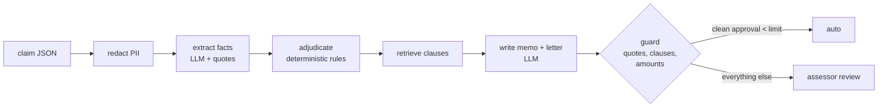

# ClaimSense: explainable health-insurance claim adjudication

> **Use case (from the use-case sheet).** *"Health insurance use cases"* and *"Insurance and claim cases"*.

A claim assessor's day: read a discharge summary, check it against a 40-page policy wording, work out waiting periods,
exclusions, room-rent limits, proportionate deductions and co-pay, and write a decision letter that cites the clause.
ClaimSense does the reading and the arithmetic, shows its working line by line, and leaves the signature to a human.

**Design principle: the LLM reads, the rules decide, a human signs off.**

1. **Redact** name, phone, email, policy number and UHID from the discharge summary (age and sex stay; they matter
   clinically).
2. **Extract clinical facts** with the LLM: diagnosis, procedure, accident or not, specific-disease match, link to a
   declared pre-existing disease, alcohol as a cause (`yes`/`no`/`unclear`), with verbatim supporting quotes.
3. **Adjudicate deterministically** (`rules.py`): 30-day initial waiting (accidents exempt), 24-month specific-disease
   waiting (with a keyword backstop if the model misses "cholelithiasis"), 36-month PED waiting, exclusions,
   non-medical items, **room-rent proportionate deduction** on associated expenses only, ICU cap, cataract sub-limit,
   20% co-pay for entry age 61+, sum-insured cap, late-submission flag. Every deduction carries its clause.
4. **Retrieve** the clauses the decision relied on (plus BM25 hits for the diagnosis).
5. **Draft** the assessor summary and the customer letter from the computed numbers.
6. **Guard**: quotes must appear in the summary, cited clauses must exist, the rejection clause must be cited, and
   **every rupee amount in the letter must be one the rules engine produced**. Otherwise: human review.
7. **Route**: only clean approvals under the auto-approve limit go straight through. Rejections, referrals, partial
   payments and high-value claims always reach an assessor.



## Course concepts in this project

| Concept | Where |
|---|---|
| LLM for reading, code for deciding (hybrid neuro-symbolic design) | `schemas.ClinicalFacts`, `rules.py` |
| PII redaction for sensitive health data (DPDP Act / HIPAA mindset) | `privacy.py` |
| RAG over policy wording with clause-level chunks and ids | `policy.py`, `retrieve_clauses` node |
| Output guardrails: grounded quotes, valid citations, no invented numbers | `guard` node |
| Risk-based human-in-the-loop routing | `rules.adjudicate()` routing, `config.AUTO_APPROVE_LIMIT` |
| Golden-set evaluation of rules and of LLM extraction separately | `evaluate.py`, `data/eval/` |

## Quick start

```bash
cd 04-use-case-projects/claimsense-health-claims
pip install -r requirements.txt
pytest -q                         # 18 tests: all 8 golden claims through the rules engine, guards, redaction
python evaluate.py --offline      # rules engine on reference facts: 100% decision / payable / route
```

With an OpenAI key:

```bash
python -m claimsense data/claims/CLM-003.json     # one claim worksheet
python -m claimsense                              # all eight
python evaluate.py                                # LLM fact accuracy + end-to-end accuracy
streamlit run app.py
```

## The eight sample claims

| Claim | Scenario | Expected |
|---|---|---|
| CLM-001 | Appendicitis, policy 28 months old | Approve INR 1,15,000 (non-medical deducted), auto |
| CLM-002 | Cataract at 14 months | Reject, clause 3.2 (24-month specific-disease waiting) |
| CLM-003 | Gallstones, deluxe room at 8,000/day vs 5,000 eligible | Partial INR 1,17,625: 62.5% on room/nursing/surgeon/OT, medicines untouched |
| CLM-004 | Pneumonia, entry age 63, submitted 35 days late | Partial INR 58,000 after 20% co-pay; late-submission flag |
| CLM-005 | Diabetic foot ulcer, diabetes declared, 18 months | Reject, clause 3.3 (36-month PED waiting) |
| CLM-006 | Road accident on day 16 | Approve INR 1,16,000: initial waiting waived for accidents |
| CLM-007 | Pancreatitis, "biliary vs alcohol-related" | Refer: exclusion 5.3 cannot be applied on an unclear cause |
| CLM-008 | CABG, INR 4.22 lakh | Approve, but above auto-approve limit: assessor review |

## Results (offline, verified)

```
decision_acc 1.00 | payable_acc 1.00 | route_acc 1.00   (rules engine, 8 claims)
```

`python evaluate.py` adds `fact_acc` (LLM extraction vs reference facts) and `memo_clean`.

## Design decisions worth defending in a review

- **No money math in prompts.** Proportionate deduction over four bill lines plus co-pay is exactly where LLMs make
  confident mistakes. Rules are code, testable to the rupee, and auditable by a regulator.
- **"Unclear" is a first-class answer.** The model is told to say `unclear` when a cause is only possible; the rules
  turn that into a referral, never a rejection.
- **Backstops on model misses.** A keyword list catches specific-disease cases the model under-reports.
- **The letter cannot invent numbers.** Any amount not produced by the rules engine sends the claim to a human.
- **Rejections always reach a person** and always cite a clause, as IRDAI rules on repudiation require.

## Adapting it

- Encode your product's wording in `data/policy/` (keep `## <clause id> <title>` headings) and its limits in
  `rules.py` / `config.py`.
- Map the claim JSON to your TPA/core-system export.
- Add ICD-10 / PCS coding and a PED-to-ICD mapping instead of free-text PED matching.
- Store assessor overrides as new golden cases; re-run `evaluate.py` before every rule or prompt change.

## Limitations

The policy wording and claims are fictional and simplified (no network-hospital tariffs, package rates, or
multi-policy coordination). This is a decision-support prototype, not a claims system.
