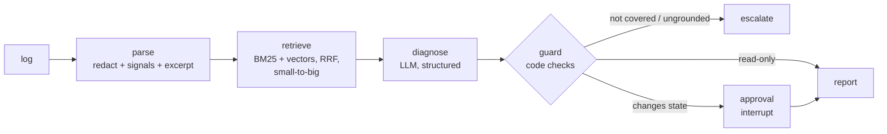

# OpsPilot: a runbook-grounded incident copilot for Kubernetes, Jenkins and Terraform

> **Use case (from the use-case sheet).** *"AI-powered Cloud & DevOps assistant for troubleshooting, monitoring,
> Kubernetes and IaC automation. Helps teams find issues faster, understand problems and automate repetitive tasks."*
> Also covers the *"Jenkins pipeline failure diagnosis agent"*, CI/CD automation and log-analyser use cases.

An on-call engineer pastes a failing `kubectl describe`, a Jenkins console log or a `terraform plan` error. OpsPilot:

1. **redacts secrets** (AWS keys, passwords, tokens, private keys) before anything leaves the machine,
2. **detects known failure signatures** with plain regex (OOMKilled, CrashLoopBackOff, state lock, disk full...),
3. **retrieves the matching runbook sections** with hybrid search (BM25 + embeddings, fused with RRF),
4. asks the LLM for a **structured diagnosis**: root cause, the exact log lines that prove it, cited runbook
   sections, and ordered steps (read-only first),
5. **checks the model's output in code**: drops invented citations, re-flags any state-changing command the model
   mislabelled, and escalates when the runbooks do not cover the failure,
6. **pauses for human approval** (LangGraph `interrupt()`) before any `kubectl scale`, `terraform force-unlock`,
   `helm upgrade`... is accepted into the plan.



## Course concepts in this project

| Concept | Where |
|---|---|
| Context engineering: send the model only the lines that matter | `signals.excerpt()` |
| Header-aware chunking with citable ids | `retrieval.load_runbooks()` |
| Hybrid retrieval and Reciprocal Rank Fusion | `retrieval.RunbookIndex.search()` |
| Small-to-big (parent document) retrieval | `retrieval.RunbookIndex.expand()` |
| Structured output with Pydantic | `schemas.Diagnosis` |
| LangGraph conditional edges, checkpointer, `interrupt()` / `Command(resume=...)` | `graph.py` |
| Guardrails: secret redaction, grounding check, deterministic safety gate | `signals.redact()`, `graph.guard` |
| Evaluation harness with a golden set | `evaluate.py`, `data/eval/golden.jsonl` |

## Quick start

```bash
cd 04-use-case-projects/opspilot-devops-copilot
pip install -r requirements.txt
pytest -q                          # 38 tests, no API key needed
python evaluate.py --offline       # parsing + retrieval metrics, no API key needed
```

With an OpenAI key (`cp .env.example .env` and fill it in, or `export OPENAI_API_KEY=...`):

```bash
python -m opspilot data/incidents/01_payments_oomkilled.log       # asks before state-changing steps
python -m opspilot data/incidents/07_terraform_state_lock.log --reject
python evaluate.py                                                # full pipeline metrics
streamlit run app.py                                              # UI with Approve / Reject buttons
```

Or open [OpsPilot_Walkthrough.ipynb](OpsPilot_Walkthrough.ipynb) (works in Colab).

## Sample data

| File | What it is |
|---|---|
| `data/runbooks/*.md` | 7 runbooks: CrashLoopBackOff, OOMKilled, ImagePullBackOff, FailedScheduling, Jenkins failures, Terraform state/auth/drift, TLS/DNS |
| `data/incidents/*.log` | 9 incidents. `06` contains leaked credentials (to prove redaction). `08` (Kafka lag) is deliberately **not** covered, so the right answer is to escalate. |
| `data/eval/golden.jsonl` | Expected platform, signals, runbook section, outcome and root-cause keywords per incident |

## Results (offline, verified)

```
signal_recall 1.00 | platform_acc 1.00 | retrieval_hit@3 1.00   (BM25 only, 9 incidents)
```

Run `python evaluate.py` with a key to add `outcome_acc`, `citation_acc` and `root_cause_hit` for the LLM stage.

## Design decisions worth defending in a review

- **Regex before LLM.** Signature matching is free, instant and deterministic. The model gets named signals plus an
  excerpt, not a 5,000-line log, which cuts tokens and stops the real error being lost in the middle.
- **The model never decides what is safe.** It labels steps `mutating`, but `is_mutating()` can only *add* that flag,
  and the approval gate is a graph edge, not a sentence in a prompt.
- **Grounded or escalated.** A diagnosis with no valid runbook citation is escalated, not shown.
- **BM25 plus vectors.** Error strings like `ConditionalCheckFailedException` are exact-match problems; paraphrased
  symptoms are semantic problems. RRF combines both rankings without tuning score scales.

## Adapting it to your environment

1. Drop your runbooks into `data/runbooks/` with `platform:` and `signals:` front matter, one `##` heading per section.
2. Add signatures for your stack to `SIGNATURES` in `signals.py` (Ansible, Helm, ArgoCD, AKS, EKS...).
3. Add real incidents (redacted) and expected answers to the golden set, then run `evaluate.py` before and after
   every prompt or retrieval change.
4. Swap `InMemorySaver` for a persistent checkpointer (SQLite/Postgres) so approvals survive restarts, and post the
   approval request to Slack/Teams instead of the CLI prompt.

## Ideas to extend (good assignments)

- Pull live context through tools: `kubectl get events`, Prometheus queries, the last Jenkins build log (read-only).
- Expose `diagnose` as an MCP tool so any MCP-capable IDE or assistant can call it from the terminal.
- Auto-draft the post-incident report from the approved plan.
- Track cost per incident with LangSmith and compare `gpt-4o-mini` vs a larger model on `evaluate.py`.

## Limitations

Synthetic runbooks and logs. Not connected to any cluster; it never executes commands, it only proposes them.
