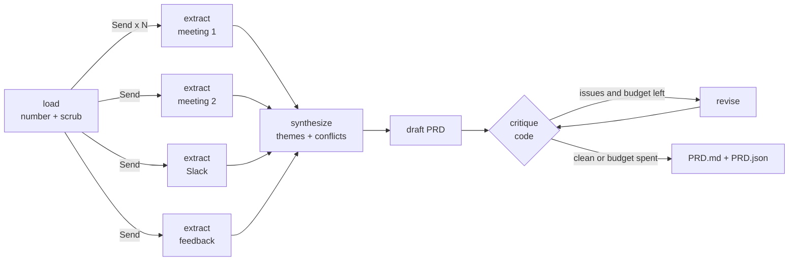

# PRDForge: meeting transcripts, Slack threads and feedback in; a traceable PRD out

> **Use case (from the use-case sheet).** *"Takes messy meeting transcripts, Slack threads, and customer feedback,
> synthesizes them, and autonomously drafts a comprehensive, structured PRD complete with user stories and acceptance
> criteria."* Domain: healthcare and pharma analytics.

The sample project is a real-shaped pharma commercial-analytics feature, **Territory Performance Alerts** for field
sales reps, with the disagreements real projects have: the Head of Sales wants daily alerts, reps and Field Ops want a
Monday digest, data only lands weekly, compliance forbids patient-level data and SMS, managers want visibility that
reps fear.

PRDForge:

1. **Numbers every line** of every source (`M1-07`, `S-03`, `F-10`) and scrubs PII.
2. **Extracts insights per source in parallel** (LangGraph `Send` map step): pain points, requests, decisions,
   constraints, metrics, open questions, each citing evidence ids. Insights citing ids that do not exist are dropped.
3. **Synthesises** themes and **conflicts** between stakeholders (reduce step).
4. **Drafts the PRD** as a typed object: goals with numeric metrics, personas, MoSCoW user stories with
   Given/When/Then acceptance criteria, constraints, decisions, open questions, risks, all with evidence ids.
5. **Critiques it in code** and **revises** until clean or out of budget:
   every story has >= 2 testable criteria (no "fast", "easy", "intuitive" without a number), every claim traces to a
   real line, every conflict is either decided with rationale or listed as an open question with an owner, every
   compliance constraint is captured.
6. **Renders Markdown** with a traceability appendix that quotes the exact line behind every citation.



## Course concepts in this project

| Concept | Where |
|---|---|
| Map-reduce with LangGraph `Send` and a list reducer (`Annotated[list, operator.add]`) | `graph.py` |
| Nested Pydantic schemas for long structured output | `schemas.py` |
| Grounding and traceability via evidence ids | `sources.py`, `extract` node, `render.py` |
| Reflection loop with a **deterministic** critic and a revision budget | `critique.py`, `critique`/`revise` nodes |
| Conflict detection instead of silent averaging | `Synthesis.conflicts`, critic rule |
| Evaluation against an expert checklist | `evaluate.py`, `data/eval/expectations.json` |

## Quick start

```bash
cd 04-use-case-projects/prdforge-transcripts-to-prd
pip install -r requirements.txt
pytest -q                              # 8 tests (fan-out, critique, revise loop, budget), no API key needed
```

With an OpenAI key:

```bash
python -m prdforge                     # writes output/PRD.md and output/PRD.json
python evaluate.py                     # conflicts surfaced, constraints captured, story topics, critique clean
streamlit run app.py                   # upload your own transcripts / Slack JSON / feedback CSV
```

Or open [PRDForge_Walkthrough.ipynb](PRDForge_Walkthrough.ipynb).

### Input formats

| Type | Format |
|---|---|
| Meeting transcript `.txt` | Header lines `Meeting:`, `Date:`, `Attendees:`, then one `Name: what they said` per line |
| Slack export `.json` | `{"channel": "...", "messages": [{"ts", "user", "text"}]}` (map your export to this) |
| Feedback `.csv` | Columns `id, role, region, channel, feedback, rating` |

## Design decisions worth defending in a review

- **Code is the critic.** An LLM reviewing an LLM tends to approve. A deterministic checklist gives a specific,
  reproducible issue list, so the revise loop converges and you can count issues per pass.
- **Conflicts are a feature.** The PRD must decide them with evidence or hand them to an owner. The tool never
  quietly picks the loudest stakeholder.
- **Every sentence is auditable.** A reviewer can click from `US-03` to `S-05` and read what Field Ops actually said.
- **Parallel extraction per source** keeps each prompt small and focused and runs N calls concurrently.

## Ideas to extend

- Add an LLM-as-judge rubric (clarity, scope, feasibility) and compare it with the deterministic critic.
- Push approved stories to Jira or Azure DevOps through an MCP tool, behind a human approval step.
- Diff two PRD versions after a new meeting and list what changed and why.
- Ingest Zoom/Teams VTT transcripts directly.

## Limitations

Synthetic sources. The critic checks form and traceability, not whether the product idea is good; that is still the
PM's job.
