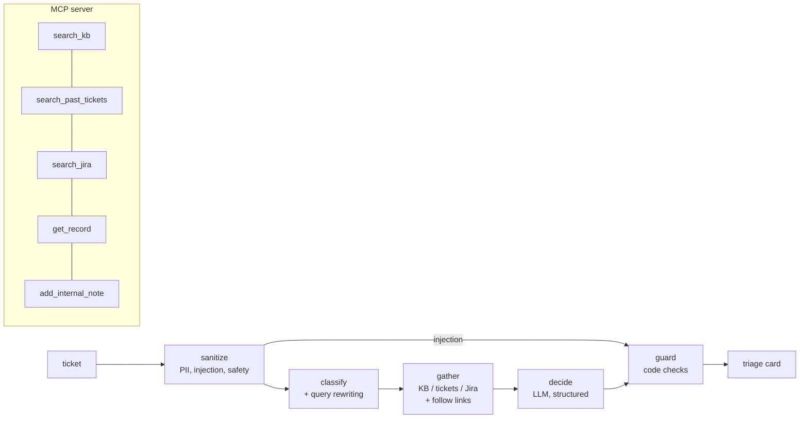

# TriageDesk: known-issue triage over Freshdesk, Jira and the KB, with a custom MCP server

> **Use case (from the use-case sheet).** *"An agentic system which can triage customer requests by looking at
> previous data from Freshdesk, Jira and available KB articles; if no info, provide general feedback."* Plus the
> requirement to build custom MCP servers for systems that have no ready-made connector.

For every new ticket TriageDesk answers the support engineer's first three questions: **is this known, what do we
already know about it, and what should I send?**

1. **Screens the input**: masks emails, phone numbers and card numbers; flags prompt-injection attempts and
   physical-safety words ("burning smell", "smoke", "sparks").
2. **Classifies** the ticket (category, severity, sentiment) and **rewrites it into 2-3 search queries**.
3. **Searches** past tickets, KB articles and Jira bugs (filtered by product), then **follows links**: a similar past
   ticket that was resolved by `KB-1004` and linked to `DISP-430` brings both into the evidence.
4. **Decides** `known_issue` / `known_bug` / `new_issue`, cites the matching ids, picks an action and drafts a reply
   that may only use steps from the evidence.
5. **Guards** the decision in code: ids not in the evidence are removed (and the verdict downgraded); Jira status
   picks *fix* (Done) vs *workaround* (Open); safety and injection tickets always go to a human with a fixed reply.

The same search functions are exposed as an **MCP server**, so any MCP client (desktop assistants, IDEs, agent frameworks,
your own Python code) can use your support data directly.



## Course concepts in this project

| Concept | Where |
|---|---|
| **Building your own MCP server** (official Python SDK v2, `MCPServer`) | `mcp_server.py` |
| Consuming MCP from Python over stdio and in-process | `mcp_client_demo.py`, `tests/` |
| Input guardrails: PII masking, injection screening, safety routing | `guardrails.py` |
| Query rewriting and multi-query retrieval | `classify` and `gather` nodes |
| Graph-style evidence expansion (follow ticket -> KB / Jira links) | `gather` node |
| Grounded structured decisions, output validation | `schemas.py`, `guard` node |
| Evaluation with labelled tickets | `evaluate.py`, `data/eval/golden.jsonl` |

## Quick start

```bash
cd 04-use-case-projects/triagedesk-support-triage
pip install -r requirements.txt
pytest -q                         # 13 tests incl. the MCP server, no API key needed
python evaluate.py --offline      # evidence recall from search alone
python mcp_client_demo.py         # launch the MCP server over stdio and call it, no API key needed
```

With an OpenAI key:

```bash
python -m triagedesk              # triage all six sample tickets
python evaluate.py                # verdict / reference / escalation accuracy
streamlit run app.py
```

### Use the MCP server from any MCP client

Add to your client's MCP configuration file (for example `mcp.json`):

```json
{
  "mcpServers": {
    "triagedesk": {
      "command": "python",
      "args": ["/absolute/path/to/04-use-case-projects/triagedesk-support-triage/mcp_server.py"]
    }
  }
}
```

Then ask: *"A VX2780 customer says the monitor turns off every 10 minutes on firmware 1.0.7. Is this known?"*

## Sample data

| File | What it is |
|---|---|
| `data/past_tickets.csv` | 20 resolved tickets in Freshdesk export shape, with `kb_id` and `jira_key` links |
| `data/jira_issues.json` | 5 Jira bugs with status, fix version and workaround |
| `data/kb/*.md` | 6 KB articles with product applicability |
| `data/incoming/new_tickets.jsonl` | 6 new tickets: 2 known bugs, 1 known issue (warranty), 1 safety hazard, 1 prompt injection, 1 genuinely new |

## Results (offline, verified)

```
evidence_recall 1.00   (expected KB / Jira ids reach the model for all 3 known tickets)
```

## Design decisions worth defending in a review

- **Fixed tool fan-out instead of a free ReAct loop** for the triage pipeline: every ticket gets the same searches,
  so cost and latency are predictable and evaluation is reproducible. The open-ended, agent-chooses-tools mode is
  available through the MCP server, where a human is in the loop.
- **Read tools are free; the write tool is fenced.** `add_internal_note` only writes private notes, masks PII, and
  goes to a local outbox until someone deliberately wires the Freshdesk API.
- **Injection never reaches the decision model.** The graph routes around it rather than hoping the prompt holds.
- **Auto-send is earned**: only high-confidence fix/workaround replies with no flags and non-critical severity.

## Adapting it to real systems

Replace the three loaders in `store.py` with API calls, keeping the same return shape:

| Source | Endpoint |
|---|---|
| Freshdesk | `GET /api/v2/search/tickets?query="..."` and `GET /api/v2/tickets/{id}/conversations` |
| Jira Cloud | `GET /rest/api/3/search/jql?jql=text ~ "..." AND project = DISP` |
| KB | Freshdesk Solutions `GET /api/v2/search/solutions?term=...`, Confluence CQL, or a vector index |

Read credentials from environment variables or a vault, never from the repo.

## Ideas to extend

- Add embeddings next to BM25 and measure recall on paraphrased tickets.
- Expose the full `triage_ticket` pipeline as an MCP tool.
- Add a LangGraph `interrupt()` so a human approves any reply where `auto_send_ok` is false.
- Cluster `new_issue` tickets weekly to spot emerging bugs before Jira has them.
